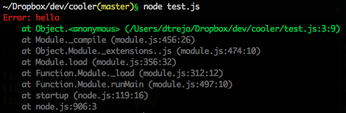

# `npm -g install cooler` errors!

### Why use this?

- print the first line of the error in red
- print the lines you wrote in green
- print the lines in node core in grey




### Usage

```js
require('cooler')
console.cool(new Error('hi'))
```
